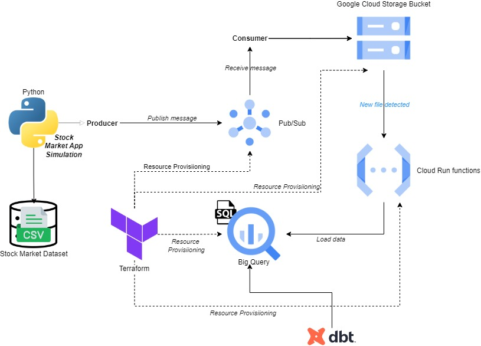

# Google Cloud Pub/Sub Infrastructure with Terraform

This project automates the deployment of Google Cloud Pub/Sub resources using Terraform. The infrastructure includes a Pub/Sub topic and subscription, allowing for messaging between different components of the system.

## Project Architecture

Below is the architecture of the project:



## Project Structure

Stock Market Real Time Data Analysis <br>
&nbsp;&nbsp;&nbsp;&nbsp;&nbsp;&nbsp;└── terraform/<br>    &nbsp;&nbsp;&nbsp;&nbsp;&nbsp;&nbsp;&nbsp;&nbsp;&nbsp;&nbsp;&nbsp;&nbsp;├── main.tf # Main entry point for orchestrating the project <br>    &nbsp;&nbsp;&nbsp;&nbsp;&nbsp;&nbsp;&nbsp;&nbsp;&nbsp;&nbsp;&nbsp;&nbsp;├── pubsub.tf # Configuration for Google Pub/Sub <br>    &nbsp;&nbsp;&nbsp;&nbsp;&nbsp;&nbsp;&nbsp;&nbsp;&nbsp;&nbsp;&nbsp;&nbsp;├── function.tf   # Configuration for Cloud Function deployment <br>    &nbsp;&nbsp;&nbsp;&nbsp;&nbsp;&nbsp;&nbsp;&nbsp;&nbsp;&nbsp;&nbsp;&nbsp;├── bucket.tf           # Configuration for Cloud Storage bucket for data ingestion <br>    &nbsp;&nbsp;&nbsp;&nbsp;&nbsp;&nbsp;&nbsp;&nbsp;&nbsp;&nbsp;&nbsp;&nbsp;├── functionBucket.tf   # Configuration for Cloud Function's code storage bucket <br>    &nbsp;&nbsp;&nbsp;&nbsp;&nbsp;&nbsp;&nbsp;&nbsp;&nbsp;&nbsp;&nbsp;&nbsp;├── dataset.tf          # Configuration for BigQuery dataset creation <br>    &nbsp;&nbsp;&nbsp;&nbsp;&nbsp;&nbsp;&nbsp;&nbsp;&nbsp;&nbsp;&nbsp;&nbsp;├── bq_table.tf         # Configuration for BigQuery table <br>    &nbsp;&nbsp;&nbsp;&nbsp;&nbsp;&nbsp;&nbsp;&nbsp;&nbsp;&nbsp;&nbsp;&nbsp;├── variables.tf # Variable definitions <br>    &nbsp;&nbsp;&nbsp;&nbsp;&nbsp;&nbsp;&nbsp;&nbsp;&nbsp;&nbsp;&nbsp;&nbsp;├── terraform.tfvars # Variable values    <br> &nbsp;&nbsp;&nbsp;&nbsp;&nbsp;&nbsp;&nbsp;&nbsp;&nbsp;&nbsp;&nbsp;&nbsp;└── terraform.tfstate # Terraform state file (auto-generated after apply) <br> &nbsp;&nbsp;&nbsp;&nbsp;&nbsp;&nbsp;└── Consumer.ipynb      # Jupyter Notebook for consuming messages from Pub/Sub <br>&nbsp;&nbsp;&nbsp;&nbsp;&nbsp;&nbsp;└── Producer.ipynb      # Jupyter Notebook for publishing messages to Pub/Sub <br> &nbsp;&nbsp;&nbsp;&nbsp;&nbsp;&nbsp;└── indexProcessed.csv  # CSV file containing the stock market data <br>&nbsp;&nbsp;&nbsp;&nbsp;&nbsp;&nbsp;└── requirements.txt    # Python package dependencies required for the Jupyter Notebooks


### Resources Deployed

- **Pub/Sub Topic**: A topic for sending messages.
- **Pub/Sub Subscription**: A subscription to recpip install dotenveive messages from the topic.
- **Cloud Storage Bucket**: A general-purpose bucket for data storage and ingestion.
- **Cloud Function Storage Bucket**: A bucket to store the zip file containing the Cloud Function code.
- **Cloud Function**: A serverless function triggered by Cloud Storage events to process data and load it into BigQuery.
- **BigQuery Dataset**: A dataset for organizing tables in BigQuery.
- **BigQuery Table**: A table for storing stock market data, with schema auto-detected.

### Key Components

- **`main.tf`**: The entry point for the Terraform configuration, defining the provider (Google Cloud) and project-level settings.
- **`pubsub.tf`**: Contains the configuration for creating the Pub/Sub topic and subscription.
- **`function.tf`**: Defines the setup for the Google Cloud Function that processes data from Cloud Storage.
- **`functionBucket.tf`**: Manages the Cloud Storage bucket specifically for storing Cloud Function code.
- **`dataset.tf`**: Creates the BigQuery dataset that holds the table for stock market data.
- **`bq_table`**.tf: Defines the BigQuery table for storing data, with schema auto-detection enabled.
- **`bucket.tf`**: Defines another bucket for Cloud Storage, used for data ingestion purposes.
- **`variables.tf`**: Defines variables such as project ID, region, topic name, and subscription name to make the configuration flexible.
- **`terraform.tfvars`**: This file contains the values for the variables defined in `variables.tf`, making it easy to customize for different environments.

## Cloud Function Overview

The Cloud Function is triggered when a JSON file is uploaded to the Cloud Storage bucket. It loads the data into BigQuery, automatically detecting the schema of the JSON file.

## Prerequisites

- [Terraform](https://www.terraform.io/downloads) v1.0.0 or later
- A Google Cloud account
- A Google Cloud project with billing enabled
- Google Cloud SDK installed on your local machine
- A service account with appropriate permissions (Pub/Sub, Cloud Functions, BigQuery, Storage)
- Zip file containing the Cloud Function code (main.py and requirements.txt)

## How to Use

1. **Clone the repository**:

   ```bash
   git clone https://github.com/imadharir/gcp-data-pipeline-stock-market.git
   cd gcp-data-pipeline-stock-market
   ```

2. **Install Terraform**

3. **Set up a virtual environment**:
    ```bash
    python3 -m venv venv
    venv\Scripts\activate
    ```

4. **Install dependencies:**:
    ```bash
    pip install -r requirements.txt
    ```

5. **Grant permissions to the Google Cloud Function service account**:
    Ensure that the service account used by Google Cloud Function has the necessary permissions to access Pub/Sub, BigQuery, and Cloud Storage.
    You can do this by adding the following roles to the service account: `Pub/Sub Publisher`, `Pub/Sub Subscriber`, `BigQuery Data Editor`, `Storage Object Admin`.
    The default service account is typically:
    ```bash
    [PROJECT_ID]@appspot.gserviceaccount.com
    ```

2. **Prepare the environment**:
    ```bash
   export GOOGLE_APPLICATION_CREDENTIALS="path/to/your-service-account-key.json"
   ```
3. **Initialize Terraform**:
    ```bash
    terraform init
    ```


4. **Plan the infrasctructure**:
    ```bash
    terraform plan
    ```
    Review the changes that Terraform will make.<br><br>


5. **Apply the infrastructure**:
    ```bash
    terraform apply
    ```
    Confirm the application by typing 'yes' when prompted.<br><br>

6. **Upload the Cloud Function zip file**: 
Ensure the zip file containing the Cloud Function code (main.py, requirements.txt) is in the correct path and gets uploaded to the specified bucket.

## Cleanup

To delete the resources created by Terraform, you can run:

```bash
terraform destroy
```
